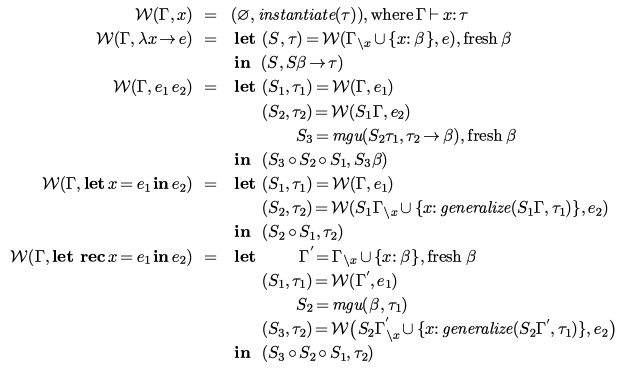

# DHM

## mgu 

## algw

## recursion

`let rec` can be desugered use `let` and fix point combinator, just extend assumptions [here](https://github.com/zjhmale/DHM/blob/master/src/hm/env.clj#L77).

